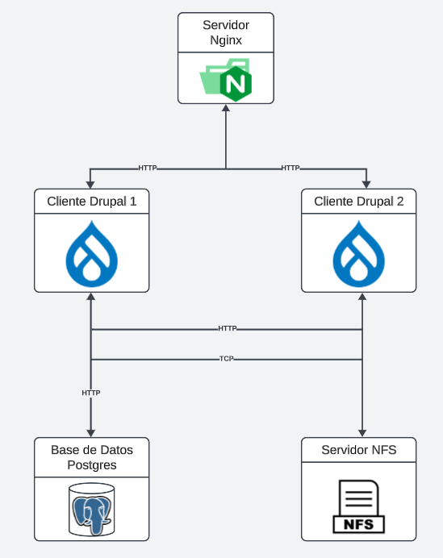

# ST02363 Tópicos Especiales en Telemática

# Estudiante: Valentina Ochoa Arbooleda, vochoaa@eafit.edu.co

# Profesor: Edwin Nelson Montoya Munera, emontoya@eafit.edu.co

# Reto 3
#
# 1. breve descripción de la actividad
#
Desplegar dos máquinas virtuales de drupal empleando contenedores. Se usa Nginx como balanceador de cargas, dos servidores adicionales tanto para la base de datos (Postgres) como para el manejo de la replicación de datos (con NFS-SERVER).

## 1.1. Que aspectos cumplió o desarrolló de la actividad propuesta por el profesor (requerimientos funcionales y no funcionales)

1. Aplicación Drupal 1 dockerizada monolítica en varios nodos que mejore la disponibilidad de esta aplicación.
2. Aplicación Drupal 2 dockerizada monolítica en varios nodos que mejore la disponibilidad de esta aplicación.
2. Implementación de un balanceador de cargas basado en nginx.
3. Tener 2 instancias de procesamiento wordpress detrás del balanceador de cargas.
4. Tener 1 instancia de bases de datos postgres.
5. Tener 1 instancia de archivos distribuidos en NFS.

## 1.2. Que aspectos NO cumplió o desarrolló de la actividad propuesta por el profesor (requerimientos funcionales y no funcionales)

Se cumplió con todo lo necesario del reto 3.

# 2. información general de diseño de alto nivel, arquitectura, patrones, mejores prácticas utilizadas.

Se tienen 5 instancias fundamentales para el desarrollo y la arquitectura del proyecto:

1. Nginx - Balanceador de carga.
2. Drupal 1.
3. Drupal 2.
4. Base de datos Postgres.
5. NFS Server.

Arquitecuta: El reto incorpora un disñeo monolítico, donde hay varios nodos que aseguran la alta disponibilidad de la misma.

Mejores prácticas: Implementación de contenedores.

# 3. Descripción del ambiente de desarrollo y técnico: lenguaje de programación, librerias, paquetes, etc, con sus numeros de versiones.

## como se compila y ejecuta.

Para cada máquina se tiene que verificar de que los contenedores esten *up* y para eso se tiene que subir los docker-compose para cada una de las máquinas(VM-DBP, VM-Drupal, VM-DRUPAL2, VM-nginx)

1. Para la maquina de la base de datos:
    - **Entrar a la máquina VM-DBP por SSH**
    - **Después utilizar el siguiente comando:**
        - *docker-compose.yml up -d*

2. Para la maquina de Drupal:
    - **Entrar a la máquina VM-Drupal por  SSH**
    - **Después utilizar el siguiente comando:**
        - docker-compose.yml up -d*

3. Para la maquina de Drupal2:
    - **Entrar a la máquina VM-DRUPAL2 por  SSH**
    - **Después utilizar el siguiente comando:**
        - *docker-compose.yml up -d*

4. Para la maquina de nginx:
    - **Entrar a la máquina VM-nginx por SSH**
    - **Después utilizar el siguiente comando:**
        - *docker-compose.yml up -d*

## detalles del desarrollo.

1. En la máquina del NFS, se tuvo que colocar la siguiente linea en /etc/exports

        /var/nfs/shared/confs    172.31.91.144(rw,sync,no_root_squash,no_subtree_check)
        /var/nfs/shared/confs    172.31.82.233(rw,sync,no_root_squash,no_subtree_check)

    Para poder tener la comunicación con ambos Drupal y poder guardar los archivos en su respectiva carpeta.

2. Para los Drupal, se tuvo que realizar el comando

        sudo mount 172.31.82.121:/var/nfs/shared/confs /nfs/shared/confs

    Para poder montar los datos en el nfs y que ambos Drupal recogieran la misma información.

3. Para cada máquina de Drupal se tuvo que realizar el comando:

        sudo nano /etc/fstab
        y luego agregar esta linea en el archivo:
        172.31.80.98:/var/nfs/shared/confs    /nfs/shared/confs   nfs auto,nofail,noatime,nolock,intr,tcp,actimeo=1800 0 0

## detalles técnicos

- **Orquestación del proyecto:** Docker (en excepción del NFS-Server)
- **Docker-compose de Nginx:**

    version: '3.1'
    services:
    nginx:
        container_name: nginx
        image: nginx
        volumes:
        - /home/ubuntu/nginx.conf:/etc/nginx/nginx.conf:ro
        ports:
        - 80:80

- **Docker-compose de los Wordpress:**

    version: '3.8'

    services:

    drupal:
        image: drupal:latest
        ports:
        - 80:80
        volumes:
        - /nfs/shared/confs/web:/var/www/html
        restart: always

- **Docker-compose de los Base de Datos:**

    version: '3.8'
    services:
    db:
        image: postgres:14.1-alpine
        restart: always
        environment:
        - POSTGRES_USER=postgres
        - POSTGRES_PASSWORD=postgres
        ports:
        - '5432:5432'
        volumes: 
        - db:/var/lib/postgresql/data
    volumes:
    db:
        driver: local

## descripción y como se configura los parámetros del proyecto (ej: ip, puertos, conexión a bases de datos, variables de ambiente, parámetros, etc)

En primer lugar se comenzo creando 5 máquinas virtuales (nginx, Drupal, Drupal2, DBP, NFS), todas con el mismo sistema operativo (Ubuntu 22.04 LTS). 
- Para la máquina de Nginx se le activan la conexión por *http* y *https*. Se dockeriza con solo nginx para despues modificar el archivo .conf en donde se redireccionan a dos direcciones IP's las cuales serán las internas de los Drupal.

- Para la base de datos, se habilitó el puerto de postgres (5432) y solo se dockerizo.

- Para el NFS-Server, se creo una máquina sin dockerizar ya que es la máquina que trae los mismos cambios.

- Para los Drupal, se crearon con conexión http y https, además se agregó el puerto de postgres para la base de datos (2049) no es necesario la IP estática, debido a que las conexiones se hicieron con la interna. Luego se hizo el mount, como se explicó anteriormente.

# 4. Descripción del ambiente de EJECUCIÓN (en producción) lenguaje de programación, librerias, paquetes, etc, con sus numeros de versiones.

El proyecto se realizo en 5 máquinas virtuales:

1. VM-ngnix: Como un balanceador de cargas.

2. VM-Drupal: drupal.

3. VM-Drupal2: drupal.

4. Base de Datos: Base de datos postgres conectada con ambos Drupal.

5. NFS-Server: Servidor que sirve para que los cambios que se hagan en ambos Drupal se vean reflejados en la misma base de datos y no sean diferentes sino que cada uno tenga la misma copia en tiempo real. 

## Como se lanza el servidor.

1. Se inicializan las máquinas.
2. Entra por el navegador a las Ip's públicas de los Drupal.
3. Se navega por el Drupal. En caso de que no cargue, se verifica en cada máquina virtual, menos la del nfs server, que los contenedores esten arriba.

## opcionalmente - si quiere mostrar resultados o pantallazos 

# 5. otra información que considere relevante para esta actividad.

# referencias:

## https://www.digitalocean.com/community/tutorials/how-to-set-up-an-nfs-mount-on-ubuntu-22-04 
## https://www.hostinger.co/tutoriales/que-es-nginx
## https://www.drupal.org/project/drupal/issues/3336659

#### versión README.md -> 1.0 (2023-Septiembre)
