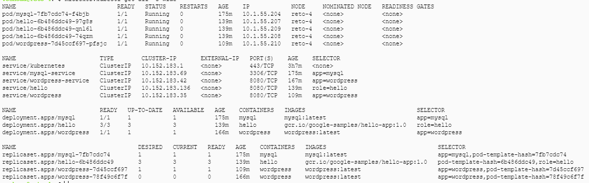
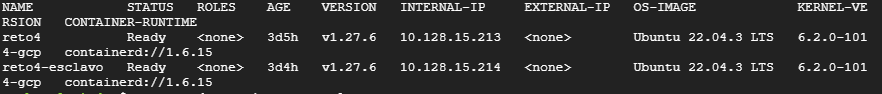

# ST02363 Tópicos Especiales en Telemática

# Estudiantes: Valentina Ochoa Arbooleda, vochoaa@eafit.edu.co
# Brigth Lorena Giraldo Vargas, blgiraldov@eafit.edu 
# Katherine Benjumena Ortiz, kbenjumeao@efit.edu.co

# Profesor: Edwin Nelson Montoya Munera, emontoya@eafit.edu.co

# Reto 4
#
# 1. breve descripción de la actividad
#
Desplegar la aplicación open source LAMP de comunidad que represente un sistema de información del tipo CMS (Content Management System) como Wordpress en ALTA DISPONIBILIDAD en un clúster de Kubernetes

## 1.1. Que aspectos cumplió o desarrolló de la actividad propuesta por el profesor (requerimientos funcionales y no funcionales)

Para este reto no fue posible cumplir con los requisitos que se planteaban. Sin embargo, se logro hacer la comunicación con Wordpress y la base de datos MySQL.

## 1.2. Que aspectos NO cumplió o desarrolló de la actividad propuesta por el profesor (requerimientos funcionales y no funcionales)

Solo se logró realizar dos máquinas virtuales, una maquina denominada maestro y otra esclavo.
No se logró implementar un dominio para el servicio. https://reto4.dominio.tld 

# 2. información general de diseño de alto nivel, arquitectura, patrones, mejores prácticas utilizadas.

Se tienen 2 instancias fundamentales para el desarrollo:

1. Reto4: Nodo maestro
2. Reto4-esclavo: Nodo maestro 

Arquitecuta: El reto incorpora un diseño para una app monolítica, donde hay se tienen dos nodos.

Mejores prácticas: Implementación de contenedores.

# 3. Descripción del ambiente de desarrollo y técnico: lenguaje de programación, librerias, paquetes, etc, con sus numeros de versiones.

## como se compila y ejecuta.

Se instalo Microk8s para la creación de clúster Kubernetes.

## detalles del desarrollo.

Se crearon los manifiestos .yaml para:
1. MySQL.yaml
2. wordpress-pv.yaml    
3. wordpress-pvc.yaml
4. wordpress-service.yaml
5. wordpress-deployment.yaml
6. wordpress-ingress.yaml

Los manifiestos se ejecutan en ese mismo orden.

Evidencia de los componentes funcionando.

No se logró comprobar el funcionamiento de wordpress dentro del local ya que al ingresar a la ip proporcionada por el cluster se rechaza la conexión.

## descripción y como se configura los parámetros del proyecto (ej: ip, puertos, conexión a bases de datos, variables de ambiente, parámetros, etc)

En primer lugar se comenzo creando 2 máquinas virtuales (Maestro y Esclavo), todas con el mismo sistema operativo (Ubuntu 22.04 LTS). 

- Para la base de datos, se habilitó el puerto de Mysql 3306.

# 4. Descripción del ambiente de EJECUCIÓN (en producción) lenguaje de programación, librerias, paquetes, etc, con sus numeros de versiones.

4. Base de Datos: Base de datos MySQL conectada con Wordpress.

## opcionalmente - si quiere mostrar resultados o pantallazos
Aqui se evidencia la creación de los componentes.

Aqui se puede evidenciar que los componentes no muestran las ip's externa que es necesaria para comprobar si Wordpress esta funcionando correctamente.

# 5. otra información que considere relevante para esta actividad.

# referencias:

## https://engr-syedusmanahmad.medium.com/wordpress-on-kubernetes-cluster-step-by-step-guide-749cb53e27c7
## https://medium.com/@icheko/wordpress-high-availability-on-kubernetes-f6c0bcc2f28d
## https://matthewdavis.io/highly-available-wordpress-on-kubernetes 
## https://medium.com/codex/how-to-deploy-wordpress-on-kubernetes-part-1-62cc5bd74410
## https://medium.com/codex/how-to-deploy-wordpress-on-kubernetes-part-2-df1cc9cbaa2e

#### versión README.md -> 1.0 (2023-Septiembre)
